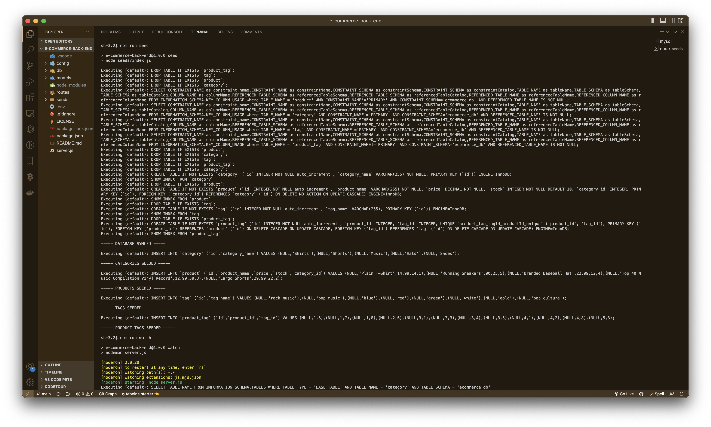
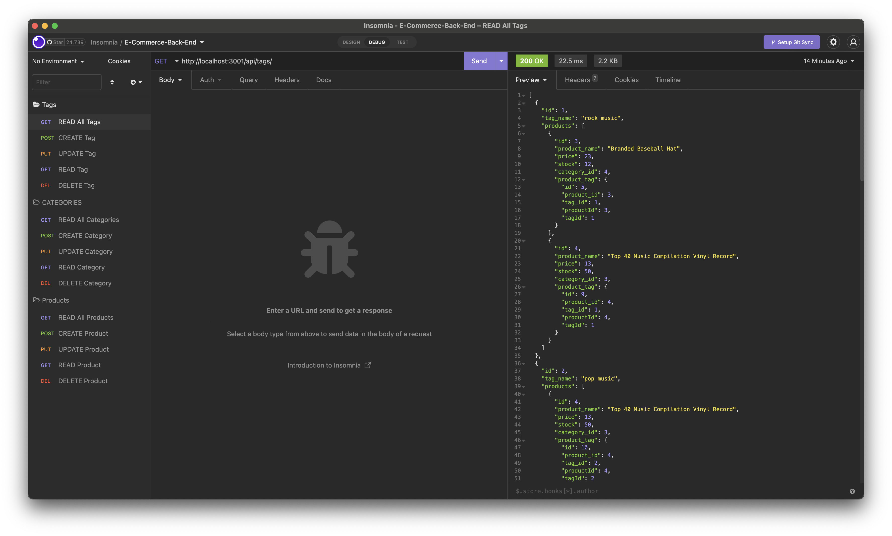

# Object-Relational Mapping Challenge

## License

[This application is under the MIT license](https://opensource.org/licenses/MIT)

## Description

The back end of an e-commerce website which uses an Express.js API and Sequelize to interact with a MySQL database.

- [Object-Relational Mapping Challenge](#object-relational-mapping-challenge)
  - [License](#license)
  - [Description](#description)
  - [Installation](#installation)
    - [Insomnia Download Link](#insomnia-download-link)
    - [Node.js Download Link](#nodejs-download-link)
    - [MySQL Download Link](#mysql-download-link)
  - [Usage](#usage)
    - [Screenshots](#screenshots)
    - [Walkthrough Video](#walkthrough-video)
  - [Contributing](#contributing)
  - [Tests](#tests)
  - [Questions](#questions)
    - [GitHub](#github)
    - [Email](#email)

<small><i><a href='http://ecotrust-canada.github.io/markdown-toc/'>Table of contents generated with markdown-toc</a></i></small>

## Installation

Clone the repository to your local machine and open E-commerce Back End in your code editor of choice (make sure to have Insomnia, Node.js and MySQL Shell downloaded, download links for all are listed down below). To install the necessary dependencies, run `npm install` in the command-line terminal.

### Insomnia Download Link

[Click here to install Insomnia](https://insomnia.rest/download)

### Node.js Download Link

[Click here to install Node.js](https://nodejs.org/en/download/)

### MySQL Download Link

[Click here to install MySQL Shell](https://dev.mysql.com/downloads/shell/)

## Usage

### Screenshots

### Walkthrough Video

Click on the video link below to learn how to use E-commerce Back End:

[E-commerce Back End Walkthrough Video Demonstration](assets/videos/e-commerce-back-end-walkthrough-video.webm)

<h3 align="left">If you have difficulty accessing the video link above you can also find it on YouTube channel! I have attached the link to my YouTube video down below ⬇️</h3>

 <a href="https://youtu.be/wpRLVU7OIvM" target="_blank" rel="noopener">E-commerce Back End Walkthrough YouTube Video</a>

## Contributing

N/A

## Tests

N/A

## Questions

If you have any additional questions, you can reach me at:

### GitHub

[jesterb0206](https://www.github.com/jesterb0206)

### Email

bradleyjester0@gmail.com
